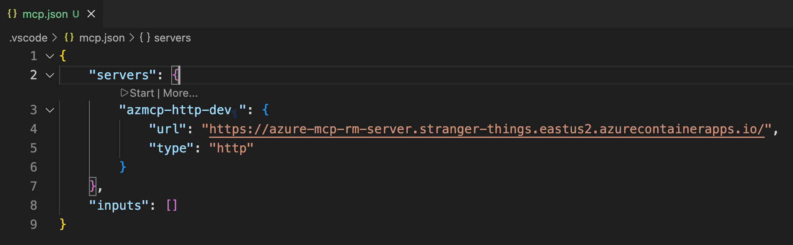
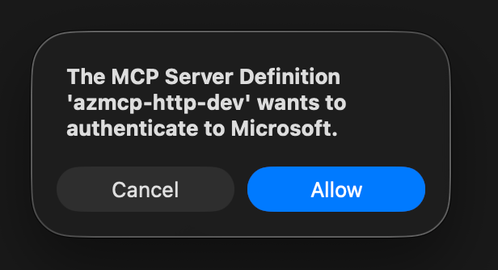
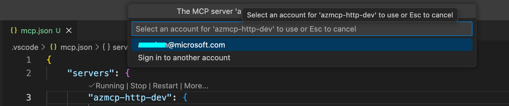
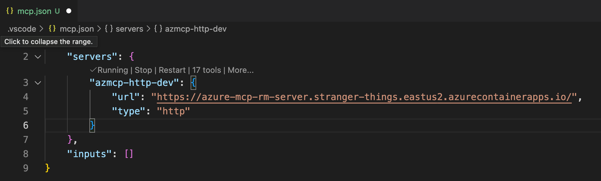

# Azure MCP Server - dev build remote deployment

This Azure Developer CLI (azd) template is for the **dev inner loop** where it build the Azure MCP Server source code with your local changes and deploy it as a remote HTTP service on Azure Container Apps.

## Prerequisites

### Azure MCP Server source code

Clone of the [microsoft/mcp](https://github.com/microsoft/mcp.git) source

### Azure Subscription

Azure subscription with **Owner** or **User Access Administrator** permissions

### Required Tools

1. **Azure CLI [az](https://learn.microsoft.com/cli/azure/install-azure-cli)**
   - Login: `az login`

2. **Azure Developer CLI [azd](https://learn.microsoft.com/azure/developer/azure-developer-cli/install-azd)**
   - Login: `azd auth login`

3. **[Docker](https://docs.docker.com/get-docker/)**
   - Ensure Docker daemon is running

4. **PowerShell [pwsh](https://learn.microsoft.com/powershell/scripting/install/installing-powershell)**
   - Required for deployment scripts that azd runs

## Deploy

1. **Copy azd-template to local microsoft/mcp clone**

    - Download azd-template [azmcp-remote-dev-deploy.zip](https://github.com/anuchandy/azmcp-remote-dev-deploy/blob/main/azmcp-remote-dev-deploy.zip), extract and copy it to the root of your local `microsoft/mcp` repo clone.

2. **Switch to the directory from PowerShell Core**
   ```bash
   pwsh
   cd /code/mcp/azmcp-remote-dev-deploy
   ```

3. **Initialize azd environment**
   ```bash
   azd init
   ```

4. **Deploy**
   ```bash
   azd up
   ```

## What Gets Deployed

The `azd up` command will:

1. Compile the Azure MCP Server for Linux x64, and build a Docker container image

2. **Provision Infra**:
   - Azure Container Registry (ACR)
   - Entra ID Application - for (OBO) OAuth2 authentication
   - Application Insights (optional)

3. **Deploy**:
   - Push Docker image to ACR
   - Deploy Container App using the image, with authentication and environment variables configured

## Configuration

Deployment configurations are managed through `infra/main.parameters.json`:

```sh
"buildConfiguration": {
  "value": "Release"  # or "Debug"
}
"outgoingAuthStrategy": {
  "value": "UseHostingEnvironmentIdentity"  # or "UseOnBehalfOf"
}
"namespaces": {
  "value": ["storage", "keyvault", "sql"]  # or [] for all namespaces
}
"appInsightsConnectionString": {
  "value": "DISABLED"  # or existing connection string, or "" to create new
}
```

## Outputs

After deployment, retrieve azd outputs:

```bash
/code/mcp/azmcp-remote-dev-deploy> azd env get-values
```

<details>

<summary>Example output:</summary>

```bash
ACR_ID="/subscriptions/145ee162-9bd2-48dc-814b-c424606897aa/resourceGroups/SSS3PT_anuchan-mcp15ccd223/providers/Microsoft.ContainerRegistry/registries/acrazmcpremoteserveraxi"
ACR_IMAGE="acrazmcpremoteserveraxi.azurecr.io/azure-mcp:latest"
ACR_LOGIN_SERVER="acrazmcpremoteserveraxi.azurecr.io"
ACR_NAME="acrazmcpremoteserveraxi"
APPLICATION_INSIGHTS_CONNECTION_STRING=""
APPLICATION_INSIGHTS_NAME="azure-mcp-remote-server-insights"
AZURE_ENV_NAME="azmcp-remote-dev-env"
AZURE_LOCATION="eastus2"
AZURE_MCP_COLLECT_TELEMETRY="False"
AZURE_RESOURCE_GROUP="SSS3PT_anuchan-mcp15ccd223"
AZURE_SUBSCRIPTION_ID="145ee162-9bd2-48dc-814b-c424606897aa"
AZURE_TENANT_ID="70a036f6-8e4d-4615-bad6-149c02e7720d"
BUILD_CONFIGURATION="Release"
CONTAINER_APP_NAME="azure-mcp-remote-server"
CONTAINER_APP_PRINCIPAL_ID="4e6a2296-f620-4ac8-b9d4-a740c7a67269"
CONTAINER_APP_URL="https://azure-mcp-remote-server.stranger-things.eastus2.azurecontainerapps.io"
ENTRA_APP_CLIENT_ID="0dfbc09b-6dd8-4de3-ae48-054c806ee59f"
ENTRA_APP_IDENTIFIER_URI="api://0dfbc09b-6dd8-4de3-ae48-054c806ee59f"
ENTRA_APP_OBJECT_ID="36227e9d-8915-42bf-a6d3-3733d745ba71"
ENTRA_APP_SERVICE_PRINCIPAL_ID="92364c66-729f-4003-9fd0-111446f5ef14"
LOCAL_DOCKER_IMAGE="azure-sdk/azure-mcp:2.0.0-alpha.99999"
NAMESPACES="[\"storage\",\"keyvault\",\"sql\",\"cosmos\"]"
OUTGOING_AUTH_STRATEGY="UseHostingEnvironmentIdentity"
```

</details>

## Client

### Connect from VS Code

1. **Create `.vscode` directory in the workspace** (if not already present)
   ```bash
   mkdir -p .vscode
   ```

2. **Create or update `mcp.json` in the `.vscode` directory**
   ```json
   {
     "servers": {
       "azmcp-http-dev": {
         "url": "https://azure-mcp-remote-server.stranger-things.eastus2.azurecontainerapps.io"
         "type": "http",
       }
     }
   }
   ```

3. **Update server entry with the URL of Container App running azmcp**
 
   Retrieve the Container App URL from azd env and use it for `mcp.json`

   ```bash
   azd env get-value CONTAINER_APP_URL
   ```

4. **Connect**

   - Click 'Start' to initiate connection
   

   - Allow authentication request

   

   - Complete login

   

   - VS Code should be now connected to Azure MCP Server

   

> **Note:** The deployed Entra App is configured with [preauthorization](https://docs.azure.cn/en-us/entra/identity-platform/permissions-consent-overview#preauthorization), which allows VS Code to request the necessary scope (`Mcp.Tools.ReadWrite`) to authenticate azmcp (a.k.a, incoming authentication) without requiring user consent prompts.

### Outgoing Authentication

#### UseHostingEnvironmentIdentity

By default, the azmcp is configured to use the **managed identity** of the Azure Container App (see `UseHostingEnvironmentIdentity` in [Configuration](#configuration)). You must assign the necessary Azure RBAC roles to the Container App's managed identity principal ID for the Azure resources that will be accessed through MCP tool execution.

To get the Container App's managed identity principal ID:
```bash
azd env get-value CONTAINER_APP_PRINCIPAL_ID
```

<details>

<summary>Example role assignments:</summary>

```bash
# Get the principal ID
PRINCIPAL_ID=$(azd env get-value CONTAINER_APP_PRINCIPAL_ID)

# Assign Storage Blob Data Contributor role
az role assignment create \
  --assignee $PRINCIPAL_ID \
  --role "Storage Blob Data Contributor" \
  --scope /subscriptions/{subscription-id}/resourceGroups/{resource-group}/providers/Microsoft.Storage/storageAccounts/{storage-account}

# Assign Key Vault Secrets User role
az role assignment create \
  --assignee $PRINCIPAL_ID \
  --role "Key Vault Secrets User" \
  --scope /subscriptions/{subscription-id}/resourceGroups/{resource-group}/providers/Microsoft.KeyVault/vaults/{key-vault}
```

</details>

#### UseOnBehalfOf

anu to talk to Steven, Srikanta on on-behalf-of flow setup
