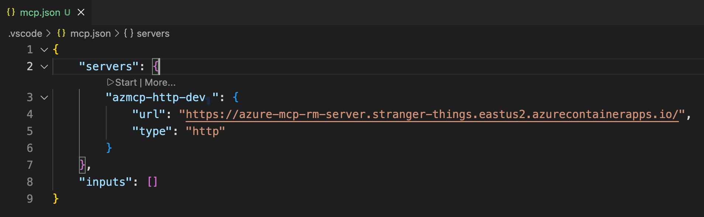
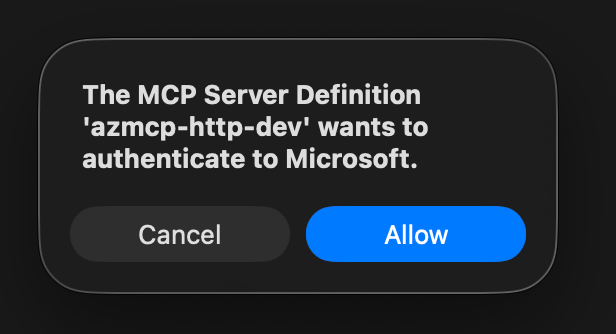
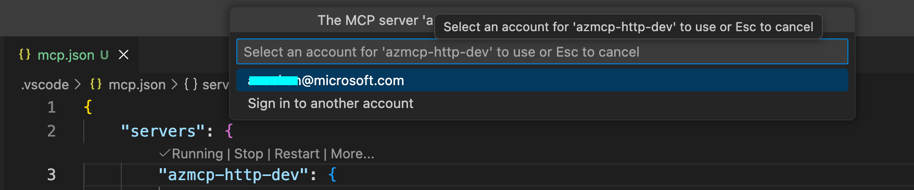
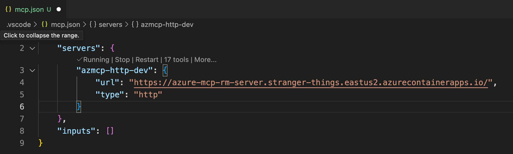

# Connect from VS Code

Connect to Azure MCP Server from VS Code.

## Prerequisites

- Azure MCP Server deployed and running (see [main README](../../README.md))
- VS Code with MCP support

## Setup

1. **Create `.vscode` directory in the workspace** (if not already present)
   ```bash
   mkdir -p .vscode
   ```

2. **Create or update `mcp.json` in the `.vscode` directory**
   ```json
   {
     "servers": {
       "azmcp-http-dev": {
         "url": "https://azure-mcp-remote-server.stranger-things.eastus2.azurecontainerapps.io",
         "type": "http",
       }
     }
   }
   ```

3. **Update server entry with the URL of Container App running azmcp**
 
   Retrieve the Container App URL from azd env and use it for `mcp.json`

   ```bash
   azd env get-value CONTAINER_APP_URL
   ```

4. **Connect**

   - Click 'Start' to initiate connection
   

   - Allow authentication request

   

   - Complete login

   

   - VS Code should be now connected to Azure MCP Server

   

> **Note:** The deployed Entra App is configured with [preauthorization](https://docs.azure.cn/en-us/entra/identity-platform/permissions-consent-overview#preauthorization), which allows VS Code to request the necessary scope (`Mcp.Tools.ReadWrite`) to authenticate azmcp (a.k.a, incoming authentication) without requiring user consent prompts.
